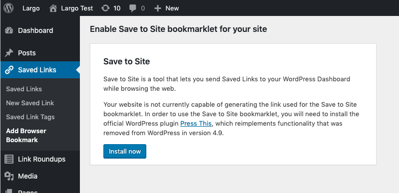

# Bookmarklet Dependencies

The "Save to Site" bookmarklet code depends on WordPress' "Press this!" bookmarklet code. That code was [removed from WordPress version 4.9](https://make.wordpress.org/core/2017/11/02/press-this-in-4-9/), and has not been reintroduced. The WordPress maintainers put the removed code into a self-contained plugin called [Press This](https://wordpress.org/plugins/press-this/).

Your site can use the "Save to Site" bookmarklet if either of these conditions are true:

- You are running WordPress 4.8 (not recommended)
- You have the [Press This](https://wordpress.org/plugins/press-this/) plugin installed and active.

If your site meets neither of those conditions, you will see the following prompt:

The "Install now" button will take you to your site's plugins page for a search of the WordPress.org plugins directory that should include the Press This plugin.
