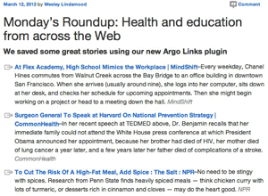

# Argo Links

This plugin makes it easy to collect links from across the web and share them right from your WordPress dashboard.

The plugin has two main features.

1. You can *collect and tag links* via a one-click bookmarklet, and have access to all your links from anywhere. The key difference from sites like Pinterest and Flipboard is that your bookmarks are stored in your WordPress database, so you'll never have to worry about accessing your links from another site.
2. You can *easily share links* via a link roundup post. The link roundup provides you with a quick and easy way of sharing the most interest stories on your beat with your readers. Sharing links in this way is a common pattern amongst bloggers and news aggregators. To learn how to save links and create link roundups, follow the steps below.

Here's how it works.

1. [Collect and tag links](saving-links)
2. [Create link roundups](link-roundups)
3. [Send your roundup to MailChimp](mailchimp)

