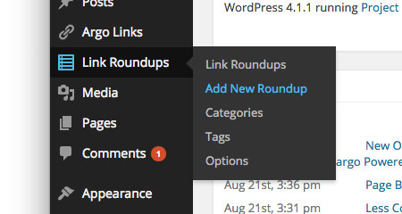
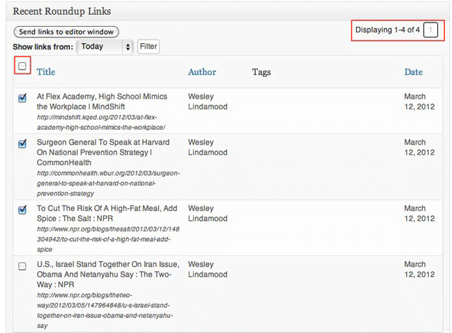
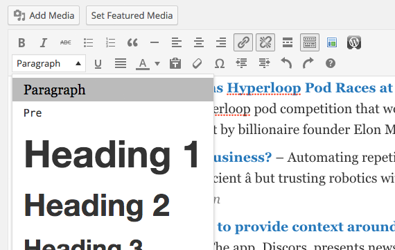

## How to Create Link Roundups

Now that you have some Saved Links, you're ready to create your first Link Roundup. 

1) Go to Link Roundups and click Add New from your WordPress Dashboard.

The new Link Roundup post will resemble a regular WordPress post in many ways... but there is one important difference: the Recent Saved Links Panel below the Editor.

Recent Saved Links lets you sort through links based on the date they were created.

2) Select one or more links to add to your roundup by sending them to the Editor.

The Recent Saved Links section shows a maximum of 15 links at one time. Use the pagination to view more pages of Saved Links, but bear in mind you must send links to the editor before switching pages -- the box won't remember links you checked on other pages, only links currently displayed.

Once you have the links that make up your roundup in the editor window, you can edit the links, change the description and make any adjustments that you'd make to a normal post. If you'd like to add a description to the post, go to the first line of the roundup and add a new line. You'll likely notice that the roundup icon that appears to the left of new roundup links appears on the blank line. To remove this icon, select "Paragraph" from the formatting menu and the formatting will be removed.

When you're satisfied with the description and links that you've added to your roundup, publish your post and congratulate yourself on some excellent curatorial work.

# Link Roundups Options

Link Roundups Options enable the following:
- Rename the Link Roundups Post Type (including public URL slug!)
- Modify the output of saved links within the [rounduplink.. ] shortcode
- Disable built-in styles (bring your own CSS)
- Enable Mailchimp integration and set defaults