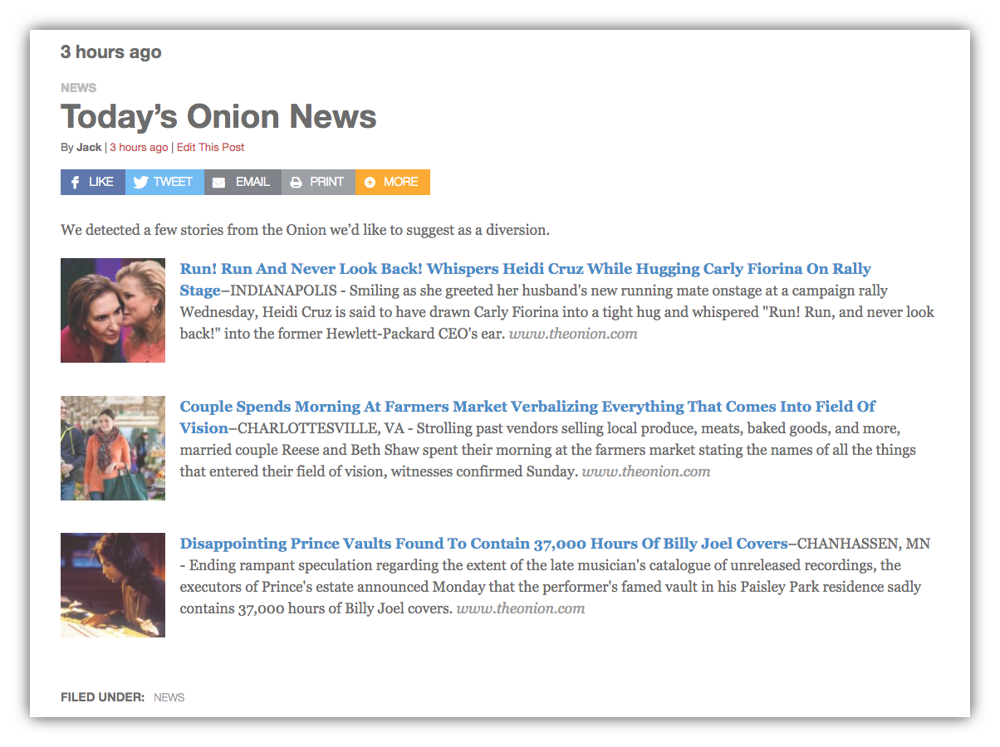

# How to Create Link Roundups

Assuming you have some [Saved Links](/docs/saved-links.md), you're ready to create your first Link Roundup.

1) Go to **Link Roundups** and click Add Link Roundup from your WordPress Dashboard.

The new Link Roundup post will resemble a regular WordPress post in many ways... but there is one important difference: the Recent Saved Links Panel below the Editor.

Recent Saved Links lets you sort through Saved Links based on the date they were created.

2) Select one or more links to add to your roundup by clicking the **Send to Editor** button.

The Recent Saved Links section shows a maximum of 15 links at one time. Use the pagination to view more pages of Saved Links, but bear in mind you must send links to the editor before switching pages -- the box won't remember links you checked on other pages, only links currently displayed.

Once you have the links that make up your roundup in the editor window, you can edit the links, change the description and make any adjustments that you'd make to a normal post. If you'd like to add a description to the post, go to the first line of the roundup and add a new line.

You can also add Categories and Tags to the Link Roundup, like any other post. _Adding one or more Categories allows filtering display of Link Roundups by Category_.

## Creating a Link Roundup using roundup_block Shortcode

An alternative way to create a Link Round is to use a special shortcode with this format:

`[roundup_block name="Today's Links"]`

The name will be displayed as a header so just change it as desired. When you add this shortcode you'll see the name of the header in a grey box: 

Hover over the box and a pencil icon appears. Click the pencil, and you'll be presented with a modal window to edit the contents:

Under each available item, click the Add button to add it to the Link Roundup:

Click the Save button in the modal window and return to find your links in the Link Roundup edit screen:

## How Link Roundups are Displayed On Your Site

Once you Publish the Link Roundup post, it displays in your homepage content stream like any other post:

Each Link Roundup also has its own single-post page which displays its Saved Links which link to the original source:

## Link Roundups Options

Link Roundups Options enable the following:
- Rename the Link Roundups Post Type (including public URL slug!)
- Modify the output of saved links within the [rounduplink.. ] shortcode
- Disable built-in styles (bring your own CSS)
- Enable Mailchimp integration and set defaults