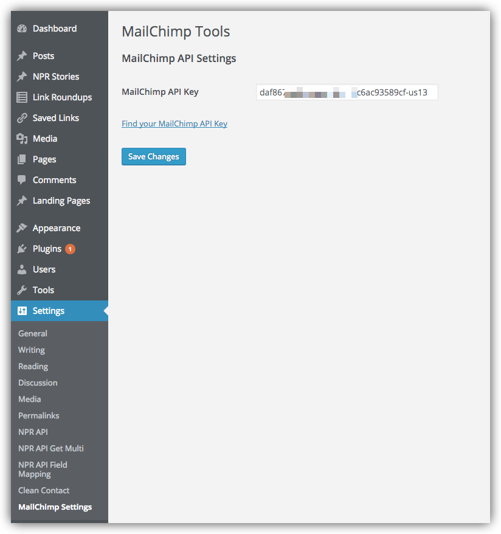
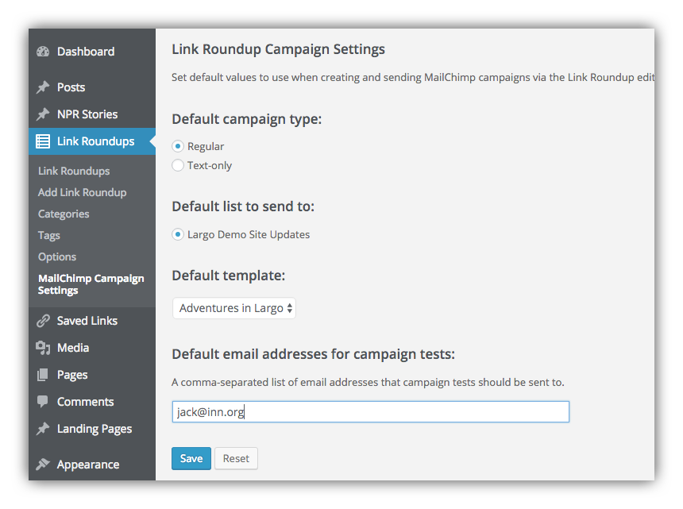
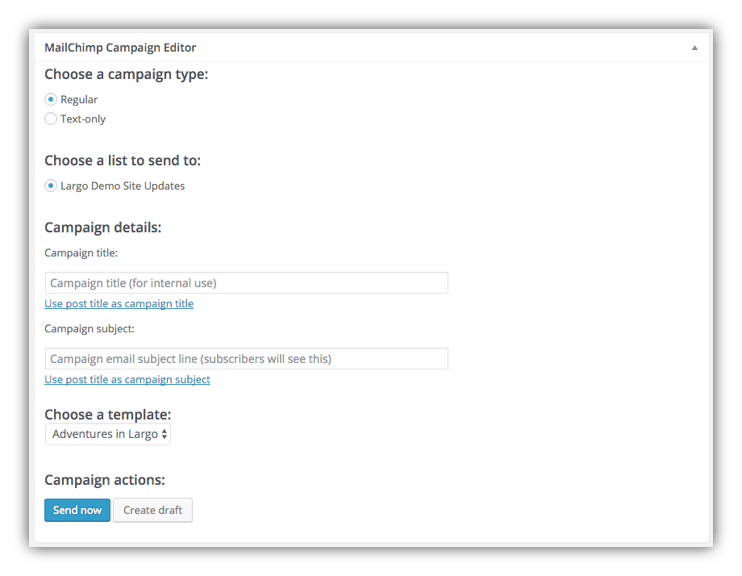
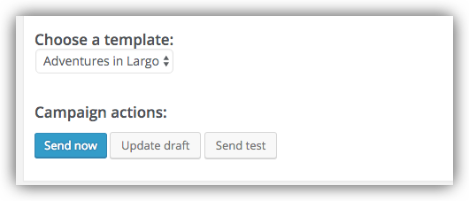
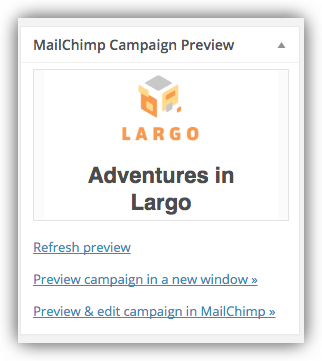

# Using Link Roundups Mailchimp Integration

Using the Mailchimp API, Link Roundups can send Roundups as newsletters via a MailChimp account.

## Prerequisites: Setup a Template and List in MailChimp

You'll need to create a template and a list if you don't already have them in MailChimp.

## Getting an API key from MailChimp

In order to use the MailChimp features of Link Roundups, you'll need to sign up for an API key from MailChimp. To do that:

1. Log in to MailChimp.
2. Click on your account in the upper-right corner. In the drop-down menu, click "Account".
3. Click on "Extras", then "API keys".
4. Click "Create A Key". A new key will appear in the list.
5. Click the "Label" field of your new API key. Name it after the site you're using Link Roundups on. For example: "example.com links"
6. Copy the API key. This will be a long string of characters from 0-9 and a-f.
7. On your WordPress site, go to **Dashboard > Settings > MailChimp Settings**.
8. Paste the MailChimp API Key into the appropriate field.
9. Press "Save Changes".

## Creating a template in the MailChimp dashboard

You'll need a MailChimp template created and configured for use with Link Roundups.

There are many options for creating MailChimp templates, but as a simple way of getting started:

1. Click on "Templates" in the MailChimp header.
2. Pick a single-column or column-and-sidebar template.
3. Edit the template being sure to use [Link Roundups template tags](#inserting-template-tags) in your template to place your content.
4. Click "Save and Exit".
5. Name your template, then save.

### Inserting template tags

This plugin's MailChimp features depend on the presence of specific tags in your MailChimp template.

You'll have to edit your template to add them, so that they can be replaced with your content when you go to send a campaign.

1. Click on "Templates" in the MailChimp header.
2. Click "Edit" on the template you want to edit.

Then, edit the template to insert the following tags where you want them to appear:

#### Required Tags:

If these template tags are not present in your MailChimp template, you will be unable to create a new Links Roundup Email Campaign.

- `*|ROUNDUPLINKS|*` - The actual list of links from the Links Roundup post

#### Optional Tags:

These template tags are not required, but you may wish to use them in your template.

- `*|ROUNDUPTITLE|*` - The Link Roundup post title
- `*|ROUNDUPAUTHOR|*` - The author of the Link Roundup post
- `*|ROUNDUPDATE|*` - The date the Links Roundu post was published
- `*|ROUNDUPPERMALINK|*` - A link back to the original Link Roundup post

## Choosing the MailChimp Template and List to use

So now you have at least one template saved in MailChimp, and we're assuming you also have a list of subscribers for your newsletter. In the WordPress Dashboard go to **Link Roundups > MailChimp Campaign Settings**, and choose your default campaign type, default mailing list, default template, and email address(es) for campaign tests:

# Creating a MailChimp Campaign

Once you have [saved some links](saving-links.md) and [created a Link Roundup post](link-roundups.md), you can send the Link Roundup post to MailChimp as a draft campaign.

In the Link Roundups editor make sure the **Mailchimp Campaign Editor** is visible. If not, visit Screen Options and select it to make it visible. You can now:

- Choose a campaign type
- Choose a list to send to
- Give your campaign a title
- Add the campaign subject line for email
- Choose which MailChimp template to use for the campaign (defaults to what was set in Link Roundups > MailChimp Campaign Settings)

Click the **Create Draft** button to create a draft MailChimp campaign. You can then view the draft campaign in your [MailChimp campaigns](https://us13.admin.mailchimp.com/campaigns/), and make any needed changes there before sending. You can also send a test email from the Link Roundup edit screen:

The **Send Test** button won't appear until after creating a draft campaign. You will then also see a new **MailChimp Campaign Preview** screen on the right side of the Link Roundup edit screen, where you can preview the campaign in a new window, or preview and edit the campaign in MailChimp:

When the draft campaign is ready to go, hist the **Send Now** button to launch the MailChimp campaign. You can also choose to launch the campaign from MailChimp if preferred.