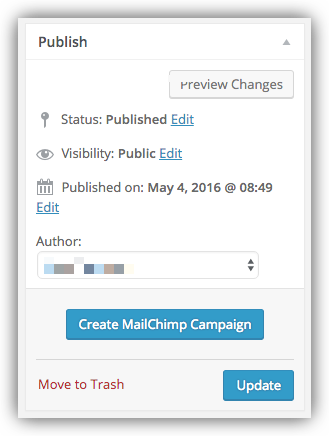

# Using Link Roundups Mailchimp Integration

Using the Mailchimp API, Link Roundups can send Roundups as newsletters via a MailChimp account.

## Prerequisites

First, you'll need:

- A MailChimp account
- An [audience](https://mailchimp.com/help/create-audience/) created in MailChimp

## Getting an API key from MailChimp

In order to use the MailChimp features of Link Roundups, you'll need to sign up for an API key from MailChimp. To do that:

1. Log in to MailChimp.
2. Follow [MailChimp's instructions for generating a new API key](https://mailchimp.com/help/about-api-keys/), and copy the API key.
3. On your website, go to **Dashboard > Settings > MailChimp Options**.
4. Paste the MailChimp API Key into the appropriate field
5. Press "Save Changes".
6. Go to **Settings > MailChimp Settings** to configure your MailChimp campaigns.


## Creating a template in the MailChimp dashboard

You'll need a MailChimp template created and configured for use with Link Roundups. This requires the use of MailChimp's [Custom Templates](https://mailchimp.com/help/import-a-custom-html-template/) with [Editable Content Areas](https://mailchimp.com/help/create-editable-content-areas-with-mailchimps-template-language/).

1. Click on "Templates" in the MailChimp header.
2. Pick a single-column or column-and-sidebar template.
3. Edit the template being sure to use [Link Roundups template tags](#inserting-template-tags) in your template to place your content.
4. Click "Save and Exit".
5. Name your template, then save.

### Inserting editable content areas

This plugin's MailChimp features depend on the presence of specific markup in your custom MailChimp template.

You'll have to edit your template to add them, so that they can be replaced with your content when you go to send a campaign.

1. Click on "Templates" in the MailChimp header.
2. Click "Edit" on the template you want to edit.

Then, edit the template to insert the content tags where you'd like them to appear. Here's an example of a fragment of an email's content:

```html
<td valign="top" class="mcnTextContent" style="padding-top:0;padding-right:18px;padding-bottom:9px;padding-left:18px;">
  <p>This should be the roundup title:</p>
  <h1 mc:edit="rounduptitle">This should be replaced with the roundup title</h1>

  <p>This should be the roundup author:</p>
  <div mc:edit="roundupauthor">This should be replaced with the roundup author</div>

  <p>This should be the roundup date:</p>
  <div mc:edit="roundupdate">This should be replaced with the roundup date</div>

  <p>This should be the roundup links:</p>
  <div mc:edit="rounduplinks">This should be replaced with the roundup links</div>

  <p>This should be the roundup permalink:</p>
  <div mc:edit="rounduppermalink">This should be replaced with the roundup permalink</div>
</td>
```

#### Required Tags:

If these template tags are not present in your MailChimp template, you will be unable to create a new Links Roundup Email Campaign.

- `mc:edit="rounduplink"` - The post content from a Link Roundup post

#### Optional Tags:

These template tags are not required, but you may wish to use them in your template.

- `mc:edit="rounduptitle"` - The Link Roundup post title
- `mc:edit="roundupauthor"` - The author of the Link Roundup post
- `mc:edit="roundupdate"` - The date the Links Roundup post was published
- `mc:edit="rounduppermalink"` - A link back to the original Link Roundup post

## Choosing the MailChimp Template and Audience to use

So now you have at least one template saved in MailChimp, and we're assuming you also have a list of subscribers for your newsletter. Go to **Link Roundups > MailChimp Campaign Settings**, and choose :

- Your defauult adience to send campaigns to
- Your default template for sending campaigns
- The defalt email address which test campaigns are sent to.

# Creating a MailChimp Campaign

Once you have [saved some links](saving-links.md) and [created a link roundup post](link-roundups.md), you can send the link roundup post to MailChimp as a draft campaign.

In the Link Roundups editor, in a box near the bottom of the page you'll see an option to create a draft or send an email. If an email has already been sent, you'll see information about where to find the sent campaign in MailChimp's admin.



Buttons that may appear at the bottom of this box are as follows:

- Send now: Sends the campaign.
- Create draft: Creates a draft camapign in MailChimp. You can update the draft using the Link Roundps editor or in MailChimp.
- Send Test: Lets you send a draft campaign.
- Update Draft: Refreshes the draft campaign in MailChimp with details from this editor.
