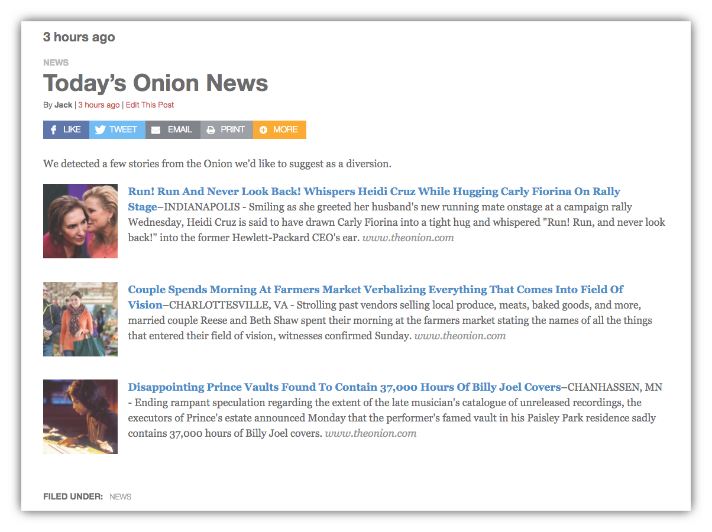

# Link Roundups Documentation

Link Roundups is a WordPress plugin that makes it easy to:

- collect links from around the web and save them in WordPress as Saved Links
- turn them into Link Roundup posts
- display Saved Links and Link Roundups in WordPress widgets on your site
- streamline the production of daily/weekly roundup newsletters using MailChimp

Get the brief introduction to plugin features in [the main Readme.md file](https://github.com/INN/link-roundups/blob/master/README.md).

## Table of Contents

1. [Installing in WordPress](installation.md)
2. [Saved Links](saved-links.md)
3. [Link Roundup Posts](link-roundups.md)
4. [MailChimp Integration](mailchimp.md)
5. [WordPress Widgets](widgets.md)
6. [Troubleshooting](troubleshooting.md)