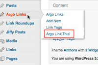
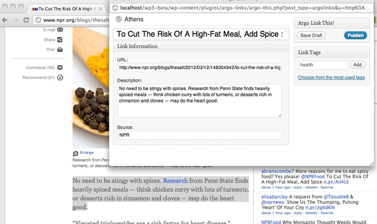
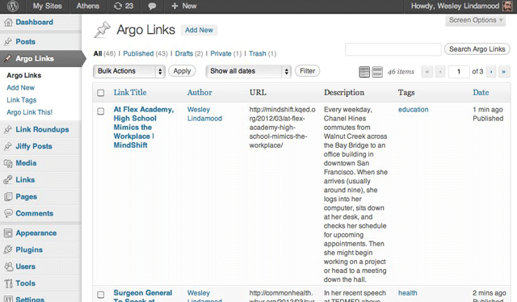

# Save Links to WordPress

Once you've [installed and activated the plugin](installation/), you should see new Saved Links and Link Roundup menu items in your Dashboard.

## Save Links via Browser Bookmark Tool (Recommended)

1. Under Saved Links, navigate to Add Browser Bookmark (Save to Site)
2. Install by dragging on to the bookmark bar of your preferred web browser.
3. Test by finding a great internet link and clicking your bookmark.
4. A popup will appear (must be allowed) with a new Saved Link screen. If you're not logged in to WordPress, a login screen will appear before you're passed through. The Save to Site Bookmark Tool attempts to prefill **Title**, **URL** and **Source** information -- saving you time!
5. **Publish** your Saved Link and resume normal web browsing.

## Save Links Manually from the WordPress Dashboard

1. In WordPress find Saved Links in the main menu and navigate to New Saved Link.
2. Add a Title for your Link (this is what is hyperlinked, we hope to perhaps add flexibility later)
3. A URL is required, paste a valid URL in the URL field.
3. Optionally define a custom slug, provide a short description, source credit.

