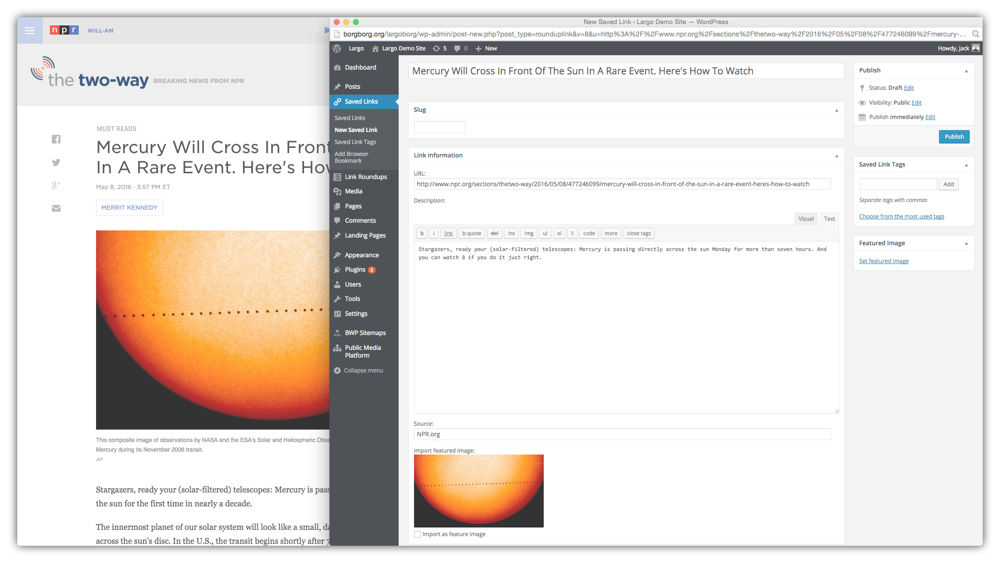

# Save Links to WordPress

Once you've [installed and activated the plugin](installation.md), you should see new Saved Links and Link Roundup menu items in your Dashboard.

## Preliminary prep work

On the WordPress Dashboard, click on **Saved Links**", then "Add Browser Bookmark". If you are prompted with a screen like the following, you'll need to [follow the instructions to enable the bookmarklet on your site](./bookmarklet-dependencies.md).

## Save Links via Browser Bookmark Tool (Recommended)

1. Under Saved Links, navigate to Add Browser Bookmark (Save to Site)

2. Install by dragging on to the bookmark bar of your preferred web browser.

3. Test by finding a great internet link and clicking your bookmark.

4. A popup will appear (you may need to adjust your browser settings to allow the popup to be displayed) with a new Saved Link screen. If you're not logged in to your WordPress site, a login screen will appear before you're passed through. The Save to Site Bookmark Tool attempts to prefill **Title**, **URL** and **Source** information -- saving you time! It will even attempt to grab a **featured image** and import that to WordPress (featured images are still a beta feature and we have improvements planned for this soon).

5. **Publish** your Saved Link and resume normal web browsing.

## Save Links Manually from the WordPress Dashboard

1. In WordPress find Saved Links in the main menu and navigate to New Saved Link.

2. Add a Title for your Link
3. A URL is required, paste a valid URL in the URL field.
3. Optionally define a custom slug, add a Featured Image, and provide a short description and the source of your Saved Link.

## Editing Saved Links

Visit the dashboard screen under **Saved Links > Saved Links** to see all your Saved Links. You can edit them just like other post types. 

## Using Saved Links in Link Roundups

Now that you have some Saved Links you can:

- [Use them in Link Roundups posts](/docs/link-roundups.md) which display like other posts on your site. 
- If you have a MailChimp account for your email newsletter, you can also easily [publish Link Roundup posts as MailChimp campaigns](/docs/mailchimp.md) from your WordPress dashboard.
- You can also display Saved Links in the [Saved Links Widget](/docs/widgets.md).
