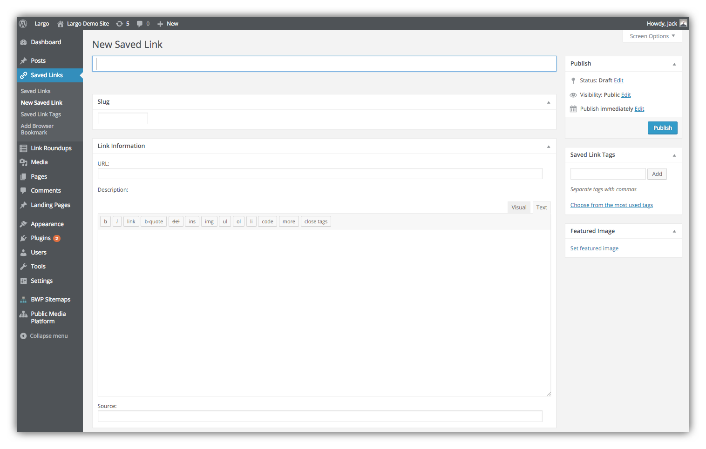

# Save Links to WordPress

Once you've [installed and activated the plugin](installation.md), you should see new Saved Links and Link Roundup menu items in your Dashboard.

## Save Links Manually from the WordPress Dashboard

1. In WordPress find Saved Links in the main menu and navigate to New Saved Link.

2. Add a Title for your Link
3. A URL is required, paste a valid URL in the URL field.
3. Optionally define a custom slug, add a Featured Image, and provide a short description and the source of your Saved Link.

## Editing Saved Links

Visit the dashboard screen under **Saved Links > Saved Links** to see all your Saved Links. You can edit them just like other post types. 

## Using Saved Links in Link Roundups

Now that you have some Saved Links you can:

- [Use them in Link Roundups posts](/docs/link-roundups.md) which display like other posts on your site. 
- If you have a MailChimp account for your email newsletter, you can also easily [publish Link Roundup posts as MailChimp campaigns](/docs/mailchimp.md) from your WordPress dashboard.
- You can also display Saved Links in the [Saved Links Widget](/docs/widgets.md).
