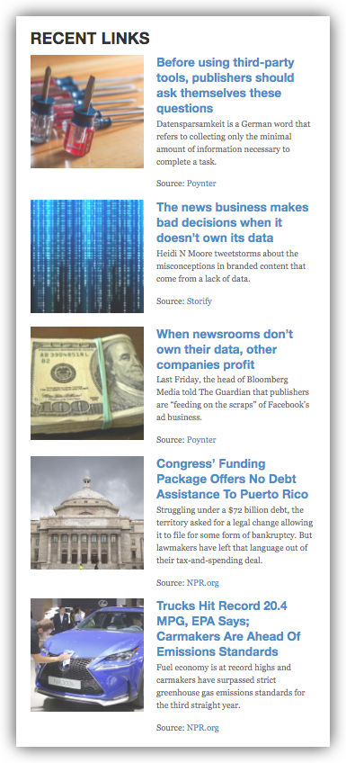
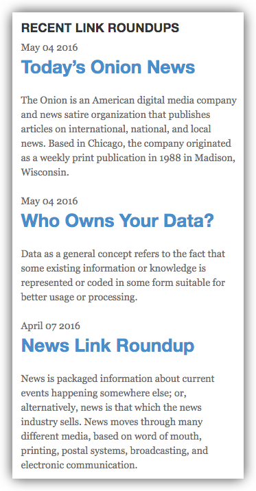

# Widgets

## Adding Widgets

Widgets can be added in the WordPress Dashboard under **Appearance > Widgets**, or alternatively in the WordPress Customizer under the **Widgets Panel**. Drag the desired widget into your desired sidebar or widget area (or click Add Widget in your desired sidebar in the case of the Customizer).

## 1. Saved Links Widget (since 0.1)

The Saved Links Widget gathers Saved Links (optionally filtered by your Saved Link Tags) and displays them as a list similar to a list of Recent Posts. You can control the number of Saved Links to show, the length of the description excerpt, control display for different devices and a hyperlinked widget title for the feed.

## 2. Link Roundups Widget (since 0.3)

After creating one or more Link Roundups, you can use the Link Roundups Widget to create links to your Link Roundups. The Link Roundups Widget shows the most recent Link Roundup(s), which can be limited to a category.

Widget options include filtering display of Link Roundups by Category, changing the default Title of "Recent Link Roundups," and adding a link and URL at the bottom of the widget.